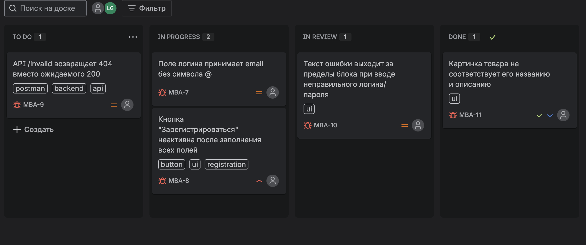

b# 🧩 Учебный проект QA — Rasul Logvin

Этот репозиторий — портфолио начинающего тестировщика **Расула Логвина**.  
Здесь собраны тест-кейсы, коллекции Postman и баг-репорты, выполненные в рамках учебных проектов.

---

## 📁 Состав репозитория

| Раздел | Содержание |
|--------|-------------|
| [`docs/test-cases.xlsx`](./docs/test-cases.xlsx) | 10 тест-кейсов для сайта [saucedemo.com](https://www.saucedemo.com) (позитивные, негативные, граничные значения) |
| [`postman/saucedemo_collection.json`](./postman/saucedemo_collection.json) | Коллекция запросов с тестами API (GET/POST/PUT/DELETE, проверка статусов и структуры JSON) |
| `README.md` | Описание проекта и инструкция по запуску |

---

## 🧠 Инструменты

- **Jira (Kanban)** — ведение баг-репортов и задач  
- **Postman** — ручное тестирование API  
- **Chrome DevTools** — исследование UI, сетевых запросов и консоли  
- **GitHub** — хранение тестовой документации  
- **OC:** macOS  
- **Браузер:** Chrome 139.0  

---

## 🚀 Как воспроизвести

1. Перейти на сайт [saucedemo.com](https://www.saucedemo.com)  
2. Логин: `standard_user`, пароль: `secret_sauce`  
3. Использовать тест-кейсы из `docs/test-cases.xlsx`  
4. Импортировать коллекцию Postman и запустить тесты  

---

## 🧩 Примеры баг-репортов

| Тип | Описание |
|------|-----------|
| **UI** | Текст ошибки выходит за границы блока при неверном логине/пароле |
| **Functional** | Поле email принимает значения без символа `@` |
| **API** | Эндпоинт возвращает `404` вместо ожидаемого `200` (пример с jsonplaceholder) |

---

## 🧾 Скриншоты тестовой документации

| Инструмент | Скриншот |
|-------------|-----------|
| **Jira (Kanban board)** |  |

> Скриншот показывает процесс тестирования и баг-трекинг в Jira.  
> Каждый баг оформлен с приоритетом, тегами и статусом.

---

| **Google Sheets (тест-кейсы)** |  |

> Таблица тест-кейсов оформлена в Google Sheets.  
> Каждый кейс содержит ID, шаги, предусловия и ожидаемый результат.  
> Используется для ручного тестирования и демонстрации QA-документирования.

---

## 📸 Скриншоты API-тестов Postman

| Метод | Скриншот |
|--------|-----------|
| **GET** |  |
| **POST** |  |
| **PUT** |  |
| **DELETE** |  |

> Каждый тест проверяет корректность структуры, статус-коды и формат ответа (JSON).  
> Тесты выполнены в **Postman**, с использованием встроенного JavaScript-валидационного движка.

---

## 🚀 Опыт и результаты работы над проектом

В рамках учебного проекта по тестированию **saucedemo.com** я выполнил полный цикл QA-документирования и тестирования:

- Провёл ручное тестирование UI и API, оформил **10 тест-кейсов** в Google Sheets.  
- Составил **4 баг-репорта** в Jira с приоритетами от Low до High.  
- Создал **Postman-коллекцию** для проверки CRUD-методов (GET, POST, PUT, DELETE).  
- Проверил корректность структуры ответов, статус-кодов и времени отклика.  
- Вёл контроль версий и тестовой документации через GitHub.

## 🧩 Формат работы

Работа выполнена в формате имитации проектной команды:
- Задачи фиксировались в **Jira Kanban-board** с распределением по статусам (To Do → In Progress → Done).  
- Тест-кейсы хранились в **Google Sheets**, API-тесты — в **Postman**.  
- Взаимодействие и документация — через GitHub.

## 📈 Результаты

- Найдено и задокументировано **3 UI-багa** и **1 API-ошибка (404 вместо 200)**.  
- Все дефекты оформлены с приоритетами и тегами.  
- Подготовлены рекомендации по улучшению UX-поведения форм и API-ответов.

## 🔧 Дальнейшее развитие

- Планирую интеграцию **автоматизированных UI-тестов** с использованием **Cypress или Playwright**.  
- Рассматриваю внедрение **Postman → Newman CI/CD pipeline** для автоматического прогона API-тестов.  
- Продолжаю развивать навыки тест-анализа, SQL и API-автоматизации.

---

## 👤 Автор

**Расул Логвин**  
QA Trainee — 2025  

📌 Инструменты: Jira · Postman · Chrome DevTools · GitHub  
📬 Контакты: [Telegram](https://t.me/pando_s)
