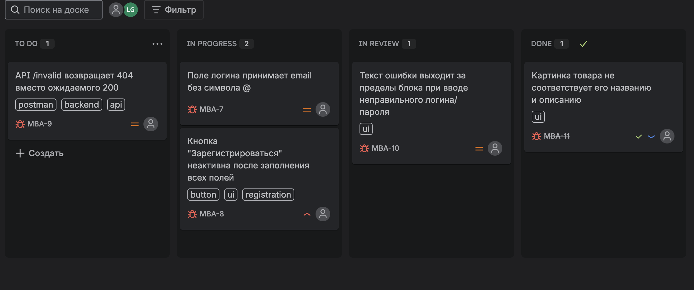
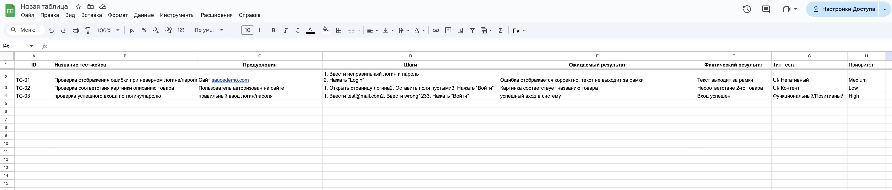
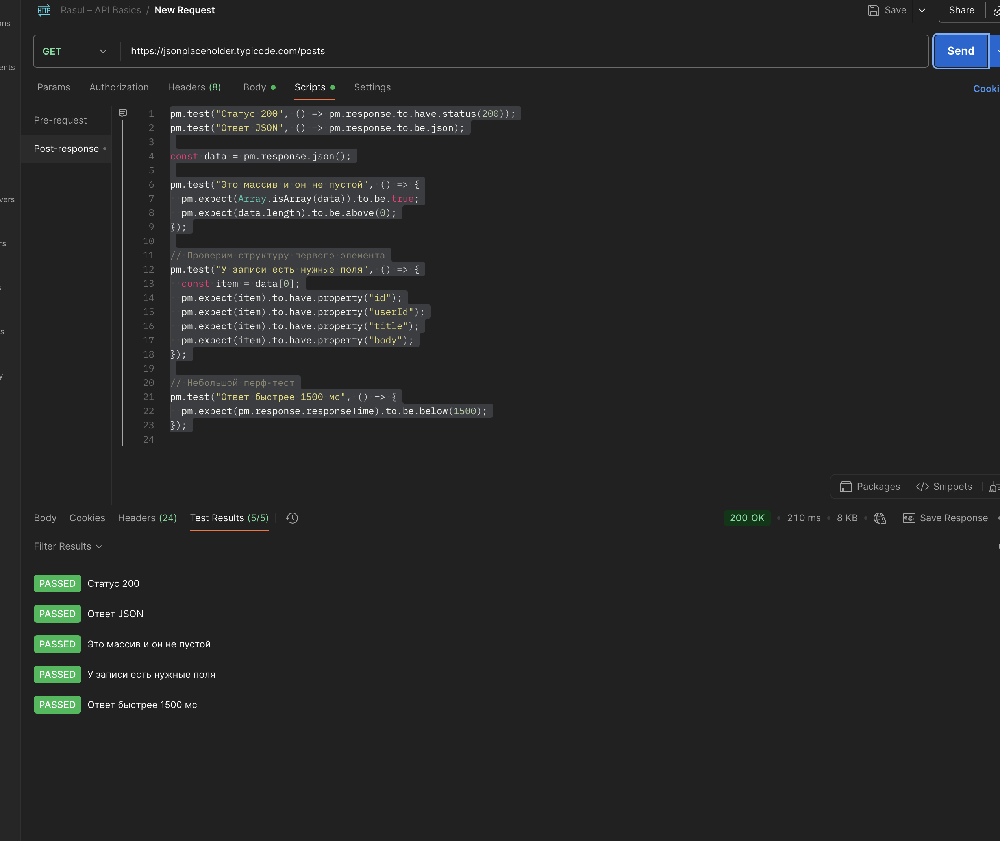
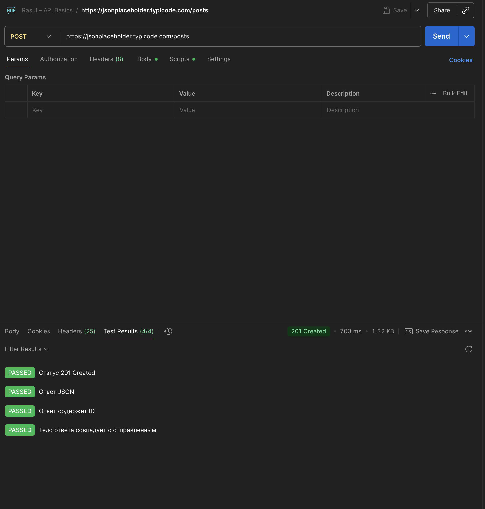
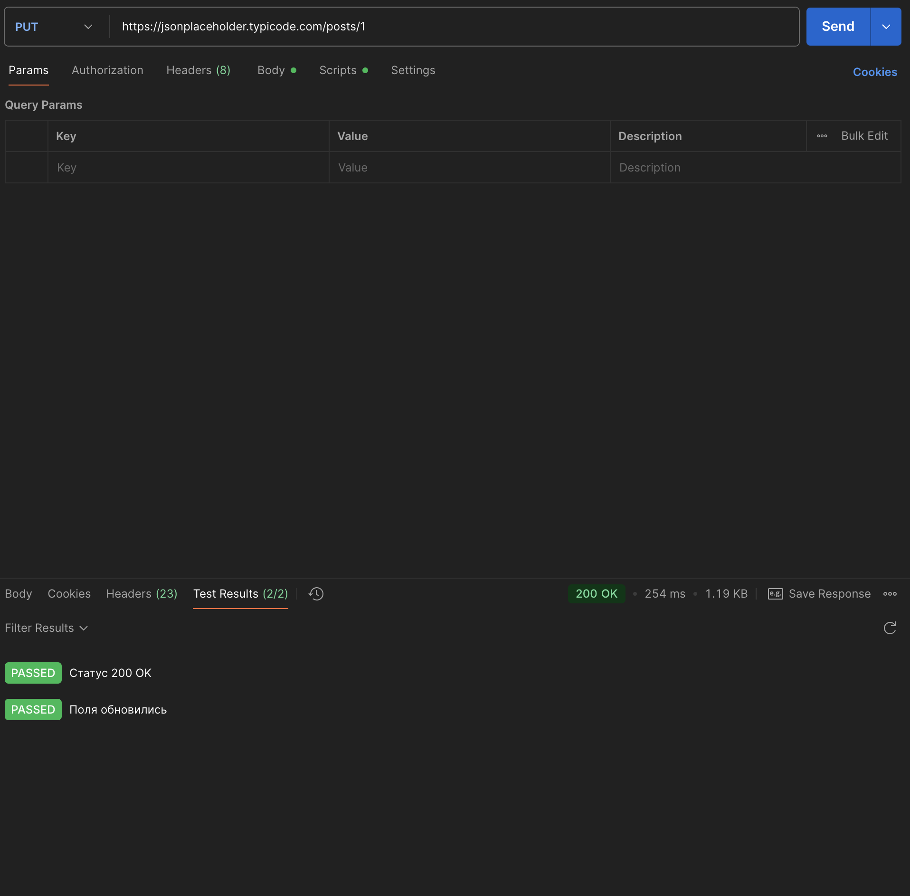
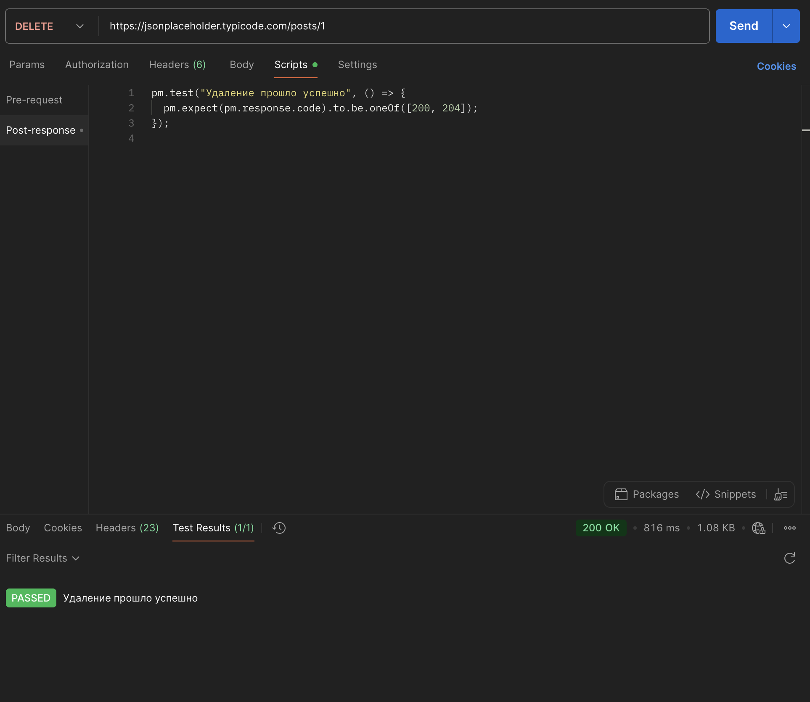

# 🧪 QA Portfolio — Rasul Logvin
Практический проект, демонстрирующий навыки ручного и автоматизированного тестирования.  
Включает три модуля:
- **Web** — тестирование UI (Selenium, Chrome DevTools, баг-репорты Jira)  
- **API** — Postman, автотесты на JSONPlaceholder и Petstore  
- **Mobile** — тестирование Android-приложения (UI, UX, сценарии регистрации)

Этот репозиторий — портфолио тестировщика **Расула Логвина**.  
Здесь собраны тест-кейсы, коллекции Postman и баг-репорты, выполненные в рамках учебных проектов.

---

**Quick links:** 
[📘 Test cases (XLSX)](docs/test-cases.xlsx) · 
[🧪 Postman collection](postman/saucedemo_collection.json) · 
[📸 Jira board (screenshot)](screenshots/jira_board.png) · 
[📸 Test cases (screenshot)](screenshots/google_sheets.png)
## 📁 Состав репозитория

---

| Раздел | Содержание |
|--------|-------------|
| [`docs/test-cases.xlsx`](./docs/test-cases.xlsx) | 10 тест-кейсов для сайта [saucedemo.com](https://www.saucedemo.com) (позитивные, негативные, граничные значения) |
| [`postman/saucedemo_collection.json`](./postman/saucedemo_collection.json) | Коллекция запросов с тестами API (GET/POST/PUT/DELETE, проверка статусов и структуры JSON) |
| `README.md` | Описание проекта и инструкция по запуску |

---

## 🧠 Инструменты

- **Jira (Kanban)** — ведение баг-репортов и задач  
- **Postman** — ручное тестирование API  
- **Chrome DevTools** — исследование UI, сетевых запросов и консоли  
- **GitHub** — хранение тестовой документации  
- **OC:** macOS  
- **Браузер:** Chrome 139.0  

---

## 🚀 Как воспроизвести

1. Перейти на сайт [saucedemo.com](https://www.saucedemo.com)  
2. Логин: `standard_user`, пароль: `secret_sauce`  
3. Использовать тест-кейсы из `docs/test-cases.xlsx`  
4. Импортировать коллекцию Postman и запустить тесты  

---

## 🧩 Примеры баг-репортов

| Тип | Описание |
|------|-----------|
| **UI** | Текст ошибки выходит за границы блока при неверном логине/пароле |
| **Functional** | Поле email принимает значения без символа `@` |
| **API** | Эндпоинт возвращает `404` вместо ожидаемого `200` (пример с jsonplaceholder) |

---

## 🧾 Скриншоты тестовой документации

| Инструмент | Скриншот |
|-------------|-----------|
| **Jira (Kanban board)** |  |

> Скрин Jira показывает процесс тестирования и баг-трекинг: каждый баг оформлен с приоритетом, тегами и статусом.  
> Таблица Google Sheets содержит тест-кейсы с ID, шагами, предусловиями и ожидаемым результатом — используется для ручного тестирования и документирования QA-процессов.

---

| **Google Sheets (тест-кейсы)** |  |

> Таблица тест-кейсов оформлена в Google Sheets.  
> Каждый кейс содержит ID, шаги, предусловия и ожидаемый результат.  
> Используется для ручного тестирования и демонстрации QA-документирования.

---

## 📸 Скриншоты API-тестов Postman

| Метод | Скриншот |
|--------|-----------|
| **GET** |  |
| **POST** |  |
| **PUT** |  |
| **DELETE** |  |

> Каждый тест проверяет корректность структуры, статус-коды и формат ответа (JSON).  
> Выполнено в Postman с использованием встроенного JavaScript-валидационного движка.  
> Для ускоренной проверки реализован перф-тест: ответ должен приходить быстрее **1500 мс**.

---

## 💼 Цель
Позиция: QA Trainee / Junior QA Engineer  
Открыт к стажировкам и коммерческим проектам в web / API тестировании.

---

## 👤 Автор

**Расул Логвин**  
📬[- Telegram: **[@pando_s](https://t.me/pando_s)**
