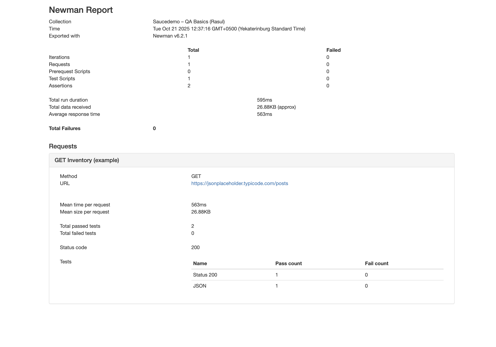

[](https://github.com/LogvinQA/qa-portfolio-logvin/actions/workflows/newman.yml)

# 🧠 QA Portfolio — Расул Логвин

### 👋 Привет!
Меня зовут **Расул Логвин**, я начинающий QA Engineer.  
В этом проекте я собрал демонстрацию полного цикла тестирования — от ручных тест-кейсов до API-тестов и автогенерации отчётов через Newman.  

---

## 📦 Что входит в проект

- **📋 Test Cases** — оформленные сценарии в Google Sheets  
- **🐞 Bug Reports** — оформленные дефекты из Jira (Kanban-доска)  
- **🔌 API-тесты** — коллекция Postman для проверки REST-эндпоинтов  
- **⚙️ Автоматический запуск через Newman (CLI)**  
- **📊 HTML-отчёт** — визуализация результатов автотестов  
- **🧾 Документация** — README с описанием структуры проекта  

---

## 🚀 Как воспроизвести проект

1. Перейти на сайт [saucedemo.com](https://www.saucedemo.com)
2. Логин: `standard_user`, пароль: `secret_sauce`
3. Использовать тест-кейсы из `docs/test-cases.xlsx`
4. Импортировать коллекцию из `postman/saucedemo_collection.json`
5. Запустить тесты в Postman или через Newman (см. ниже)

---

## 🧩 Примеры баг-репортов

| Тип | Описание |
|-----|-----------|
| **UI** | Текст ошибки выходит за границы блока при неверном логине/пароле |
| **Functional** | Поле email принимает значения без символа `@` |
| **API** | Эндпоинт возвращает `404` вместо ожидаемого `200` (пример с jsonplaceholder) |

---

## 🖼️ Скриншоты тестовой документации

### Jira (Kanban-board)


> Скриншот демонстрирует процесс баг-трекинга.  
> Каждый баг имеет приоритет, статус и тег.

---

### Google Sheets (тест-кейсы)


> Каждый тест-кейс включает ID, шаги, предусловия и ожидаемый результат.  
> Используется для ручного тестирования и документирования QA-процесса.

---

## 🔬 Скриншоты API-тестов Postman

| Метод | Скриншот |
|-------|-----------|
| **GET** |  |
| **POST** |  |
| **PUT** |  |
| **DELETE** |  |

> Каждый тест проверяет корректность структуры, статус-кодов и формата ответа (JSON).  
> Все тесты валидированы через JavaScript-скрипты Postman.

---

## ▶️ Запуск API-тестов через Newman

Newman — это CLI-инструмент для автоматического запуска Postman-коллекций.  
Он позволяет получать отчёты о результатах прямо из терминала и формировать HTML-файлы для визуализации.

### 💾 Установка

```bash
npm install -g newman
npm install -g newman-reporter-html
```
### 🚀 Запуск коллекции

```bash
newman run postman/saucedemo_collection.json \
--reporters cli,html \
--reporter-html-export screenshots/newman_report_example.html
```

## 📊 Пример HTML-отчёта Newman

HTML-отчёт генерируется автоматически и отражает:
- статус-коды запросов;
- время отклика;
- количество Passed-тестов.



✅ Все тесты завершились успешно — статус **200 OK**, формат **JSON**, ошибок нет.

---

## 🔁 Автоматизация UI (Playwright + Pytest)

**Реализовано:**
- Позитивный сценарий логина (`standard_user / secret_sauce`)
- Негативные сценарии логина (пустые поля, заблокированный пользователь, неверные данные)
- Проверка открытия страницы товаров и элементов корзины

**Стек:**  
Python · Pytest · Playwright · pytest-html

**Как запустить локально:**
\` \` \`bash
pip install -r requirements.txt
python3 -m playwright install --with-deps
pytest -m ui
\` \` \`

---
## 🎯 Результаты проекта

- Подготовлены 3 тест-кейса для UI и API.  
- Выполнено тестирование сайта [saucedemo.com](https://www.saucedemo.com).  
- Оформлены баг-репорты в Jira-доске.  
- Реализована проверка API через Postman.  
- Настроен запуск коллекции через Newman с HTML-отчётом.  

---

## 📚 Что я узнал

- Освоил цикл QA-документации: **тест-кейсы → баг-репорты → отчёт**.  
- Отработал навыки **REST-тестирования** и API-валидации.  
- Освоил **CLI-инструмент Newman** и генерацию HTML-отчётов.  
- Закрепил практику работы с **GitHub** и оформлением документации в Markdown.  

---

## 🔮 Следующие шаги

- Добавить негативные сценарии API.  
- Настроить **GitHub Actions** для CI-запуска тестов.  
- Изучить автотесты для UI (**Selenium / Playwright**).  
- Интегрировать Postman-коллекцию в **Jenkins pipeline**.  

---

## 👤 Автор

**Расул Логвин**  
📩 Telegram: [@pando_s](https://t.me/pando_s)  
💼 Позиция: *QA Trainee / Junior QA Engineer*  
Открыт к стажировкам и коммерческим проектам в **web / API-тестировании**.
